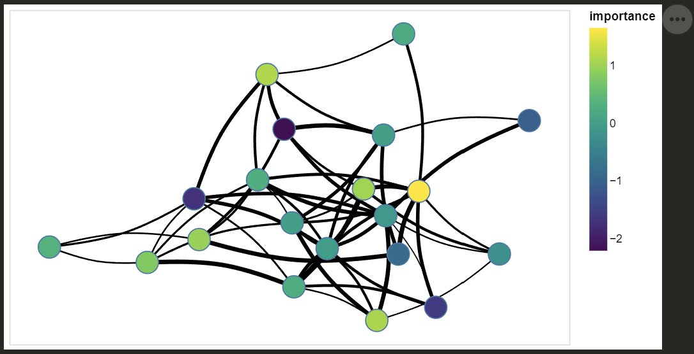

# altair-nx

[![Documentation Status][rtd-badge]][rtd-link]
[![PyPI Version][pypi-version]][pypi-link]
[![PyPI Downloads][pypi-downloads-badge]][pypi-downloads-link]
[![Python Versions][python-versions-badge]][python-versions-link]
[![License][license-badge]][license-link]
[![Actions Status][actions-badge]][actions-link]

[//]: # ([![Conda-Forge][conda-badge]][conda-link])
[//]: # ([![PyPI platforms][pypi-platforms]][pypi-link])
[//]: # ([![GitHub Discussion][github-discussions-badge]][github-discussions-link])
[//]: # ([![Gitter][gitter-badge]][gitter-link])

*Draw interactive NetworkX graphs with Altair*

**altair-nx** offers a similar **draw** API to NetworkX but returns Altair Charts instead.

This project started as a fork of [nx-altair](https://github.com/Zsailer/nx_altair) (inactive since 2020)
meant for fixing issues and merging pull requests,
but after a full code-base rework (causing backward and forward incompatibility)
and the implementation of new features (e.g. curved edges, self loops, and greater customisation),
it became reasonable for it to be its own library.

Installation: `pip install altair-nx`


## Examples

Every function argument is explained in the [documentation][rtd-link] (and most IDEs will pull from it on hover or for auto-complete),
but the simplest starting point for altair-nx is playing around with the [tutorial notebook](examples/altair-nx-tutorial.ipynb).

*PS: if you draw something cool or which could be a good example of using combinations of the various features,
feel free to put it in a notebook and open a pull request with it added to the [examples' folder](https://github.com/T-Flet/altair-nx/tree/master/examples>).*


### Simple graph

```Python
import networkx as nx
import altair_nx as anx

# Generate a random graph
G = nx.fast_gnp_random_graph(n = 20, p = 0.25)

# Compute node positions
pos = nx.spring_layout(G)

# Draw the graph with altair-nx
viz = anx.draw_networkx(G, pos)

# Display it and make it interactive
viz.interactive()
```


### Minimal customisation

Many of **altair-nx**'s style configuration arguments (most being similar to NetworkX's)
support declarative mapping to node and edge attributes (e.g. colours, shapes, and sizes).
Again, see the [documentation][rtd-link] or the [tutorial notebook](examples/altair-nx-tutorial.ipynb),
but here is a simple styling of the graph from above:

```python
import numpy as np

# Add attributes to nodes and edges
for n in G.nodes(): G.nodes[n]['importance'] = np.random.randn()
for e in G.edges(): G.edges[e]['weight'] = np.random.uniform(1, 10)

# Draw the graph with altair-nx
viz = anx.draw_networkx(G, pos,
    node_colour = 'importance', node_cmap = 'viridis',
    edge_colour = 'black', edge_width = 'weight', curved_edges = True
)

# Display it and make it interactive
viz.interactive()
```



### Leverage Altair for deeper interactivity

Also in the [tutorial notebook](examples/altair-nx-tutorial.ipynb):

<video src = 'https://github.com/T-Flet/altair-nx/assets/6699494/ebea7310-7235-4865-86e8-85d7de5a0d09'>


<!-- prettier-ignore-start -->
[actions-badge]:            https://github.com/T-Flet/altair-nx/workflows/CI/badge.svg
[actions-link]:             https://github.com/T-Flet/altair-nx/actions
[conda-badge]:              https://img.shields.io/conda/vn/conda-forge/altair-nx
[conda-link]:               https://github.com/conda-forge/altair-nx-feedstock
[github-discussions-badge]: https://img.shields.io/static/v1?label=Discussions&message=Ask&color=blue&logo=github
[github-discussions-link]:  https://github.com/T-Flet/altair-nx/discussions
[gitter-badge]:             https://badges.gitter.im/https://github.com/T-Flet/altair-nx/community.svg
[gitter-link]:              https://gitter.im/https://github.com/T-Flet/altair-nx/community?utm_source=badge&utm_medium=badge&utm_campaign=pr-badge
[pypi-link]:                https://pypi.org/project/altair-nx/
[pypi-platforms]:           https://img.shields.io/pypi/pyversions/altair-nx
[pypi-version]:             https://img.shields.io/pypi/v/altair-nx
[pypi-downloads-badge]:     https://pepy.tech/badge/altair-nx
[pypi-downloads-link]:      https://pepy.tech/project/altair-nx
[python-versions-badge]:    https://img.shields.io/pypi/pyversions/altair-nx.svg
[python-versions-link]:     https://pypi.python.org/pypi/altair-nx/
[rtd-badge]:                https://readthedocs.org/projects/altair-nx/badge/?version=latest
[rtd-link]:                 https://altair-nx.readthedocs.io/en/latest/?badge=latest
[license-badge]:            https://img.shields.io/pypi/l/altair-nx.svg
[license-link]:             https://github.com/T-Flet/altair-nx/blob/master/LICENSE
<!-- prettier-ignore-end -->


